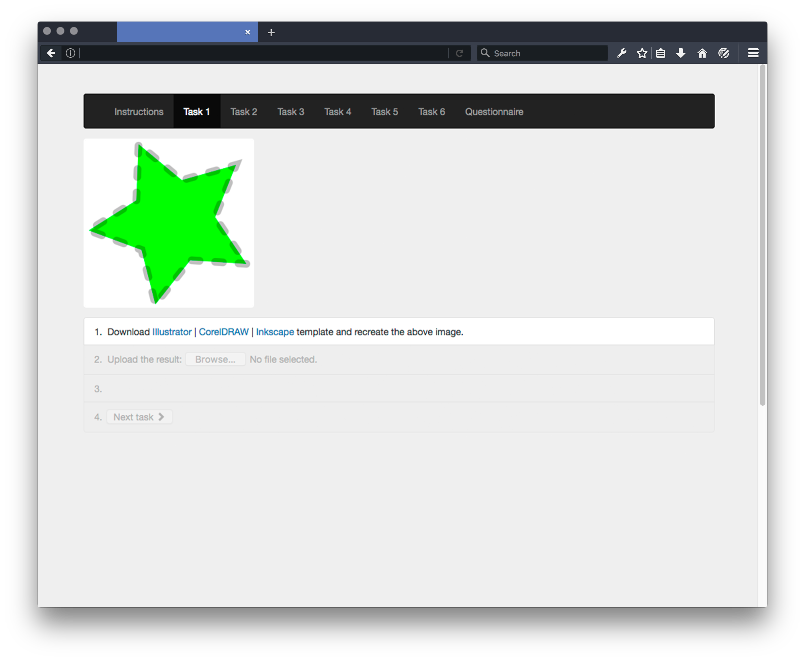

# Corvet

Automatic marker for vector graphics drawing tasks

Basically -- you get a graphic, redraw it in Illustrator/Inkscape, and the web-app tells you how well you did it.

* [demo](http://corvet.tabreturn.com)
* [some findings](https://tabreturn.github.io/code/2016/12/10/comparing_colours.html)

Run
---
CD to the project root and run:
* ./node_modules/.bin/ember serve
* cd ./dist; python3.4 corvet.py
